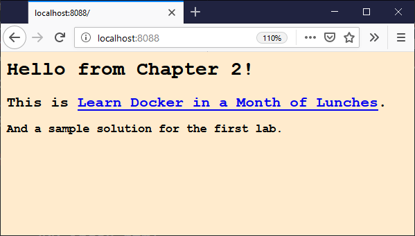

# 第二章 简单的解决方案

1. 从本章节练习中运行 Web 容器:

```
> docker container run --detach --publish 8088:80 diamol/ch02-hello-diamol-web

86b20cd8e846d7ea8cf29d08d8c22118f925cca818ab28765d218c7585dbc52d
```

> 记下容器 ID 的开头，以便可以使用容器。在这个例子中，它是 `86b`

2. _[可选步骤]_ 检查容器中的 HTML 页面是否位于预期位置（/usr/local/apache2/htdocs）:

- 在linux系统使用`ls` 命令:

```
> docker container exec 86b  ls /usr/local/apache2/htdocs
index.html
```

- 在linux系统使用`dir` 命令, 但是需要对 `cmd` 增加参数:

```
# 增加 /s /c 参数
docker container exec 86b cmd /s /c dir C:\usr\local\apache2\htdocs
index.html
```

3. 我们知道 HTML 文件在容器内的位置, 所以我们可以使用 `docker container cp` 将本地文件复制到容器中. 这将把本机中当前路径下的`index.html`复制到容器内的对应路径下，替换掉原来的`index.html`文件:

```
docker container cp index.html 86b:/usr/local/apache2/htdocs/index.html
```

`cp`命令的格式是`[源路径] [目标路径]`. 容器可以是源路径或路径, 需要在容器文件路径前面加上容器ID (这里是`86b` ). 在Linux或Windows上，您可以在`cp`命令中使用与正斜杠相同的文件路径格式.

> 如果您在Windows 10上使用Windows容器，则可能会收到针对正在运行的Hyper-V容器的错误文件系统操作不受支持的消息，这意味着您需要在运行`docker container cp`命令之前使用`docker container stop<id>`停止容器，然后使用`docker container start <id>`再次启动容器。

4. 浏览到已发布的端口 http://localhost:8088 - 您将看到您的新内容:



## 注意

在容器内，Apache Web 服务器在已知位置返回 HTML 文件的内容。在这里，我们用本地计算机中的新文件覆盖了容器中的文件。现在，当Apache提供页面时，它是新内容。

不过，只是在这个容器中，我们并没有更改Docker镜像中的文件。如果移除容器并启动一个新容器，您将看到它显示原始HTML页面。